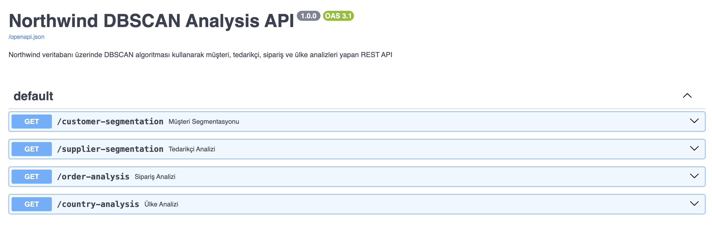
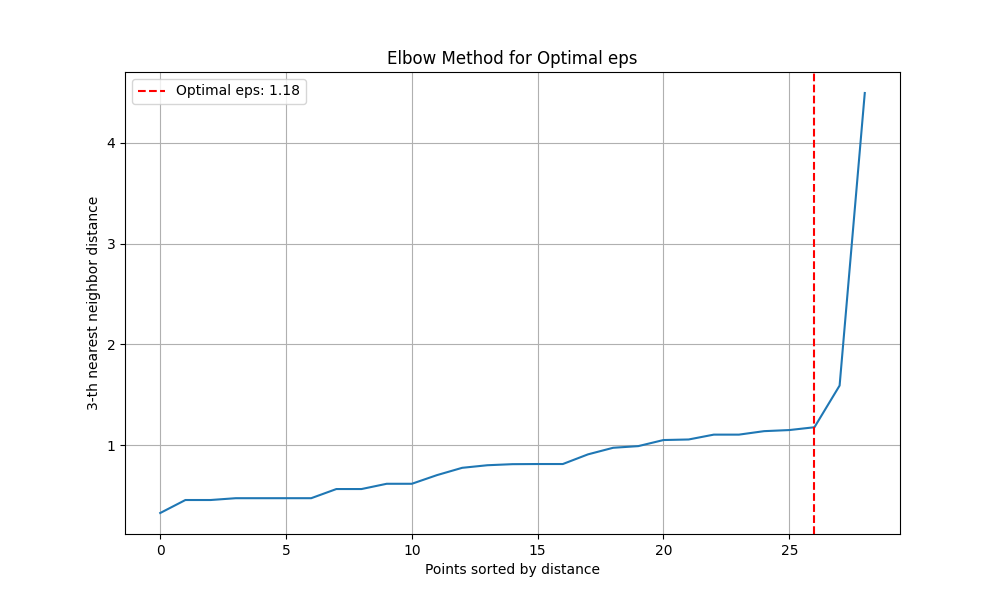
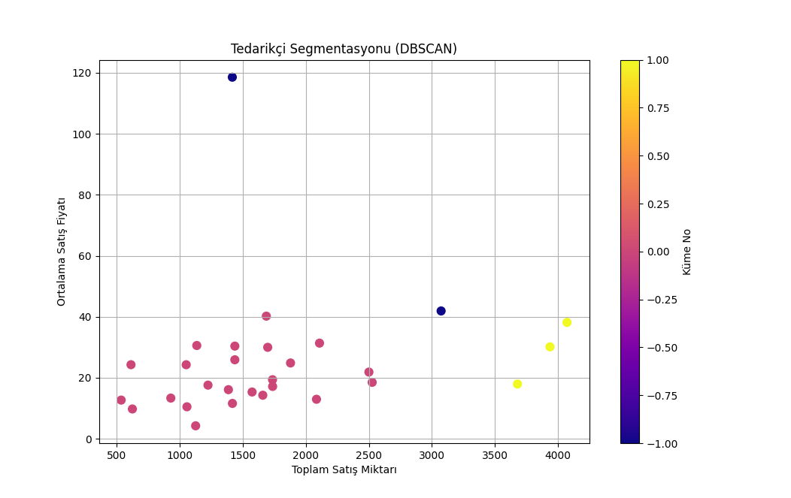
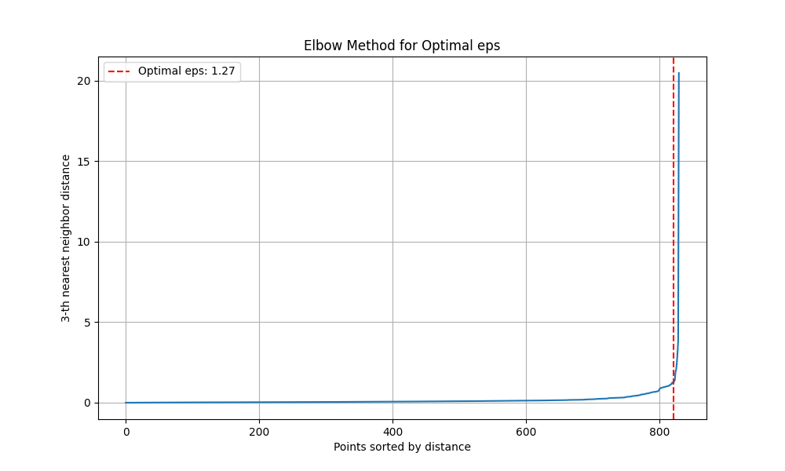
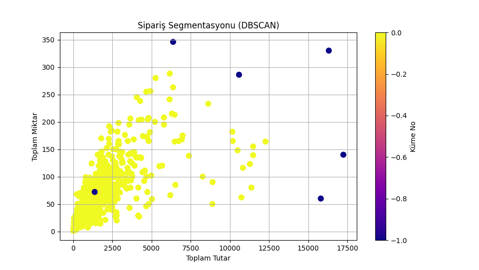
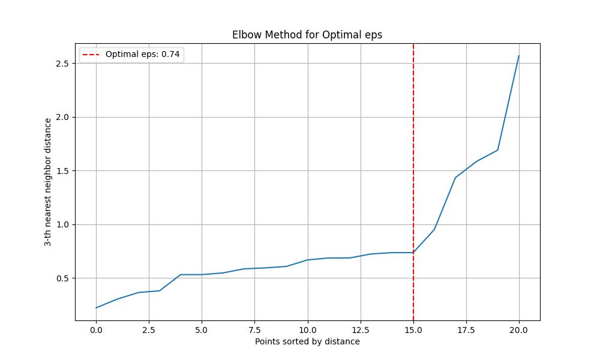
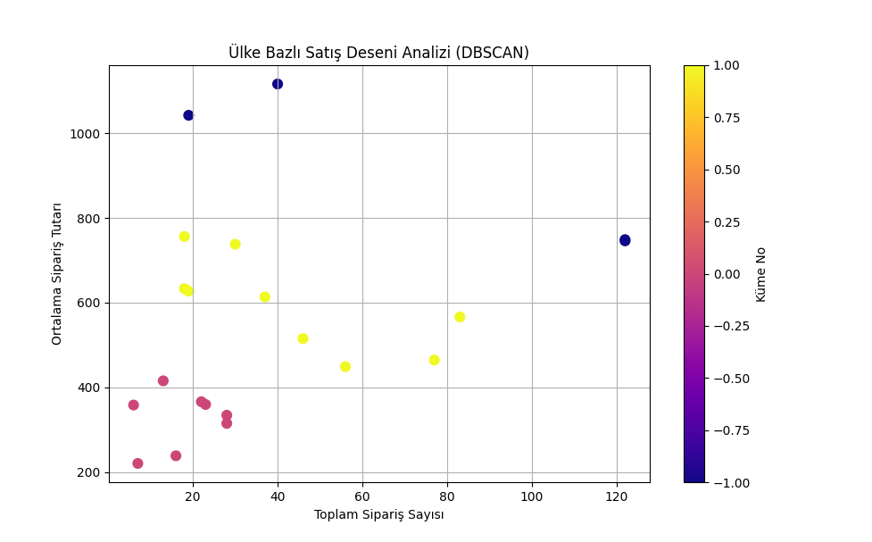

# Northwind DBSCAN Analysis API

Bu proje, Northwind veritabanı üzerinde DBSCAN algoritması kullanarak çeşitli analizler yapan bir REST API'dir. API, müşteri segmentasyonu, tedarikçi analizi, sipariş analizi ve ülke bazlı analizler gibi farklı analizler sunmaktadır.

## Proje Yapısı

```
.
├── analyzers/                 # Analiz modülleri
│   ├── customer_analyzer.py   # Müşteri segmentasyonu
│   ├── supplier_analyzer.py   # Tedarikçi analizi
│   ├── order_analyzer.py      # Sipariş analizi
│   └── country_analyzer.py    # Ülke bazlı analiz
├── images/                    # Analiz görselleri
│   ├── swagger_endpoints.png  # API endpoint'leri görseli
│   ├── customer_dbsan.png     # Müşteri segmentasyonu görseli
│   ├── customer_dbscan_1.png  # Müşteri segmentasyonu detay görseli
│   ├── supplier_dbscan.png    # Tedarikçi analizi görseli
│   ├── suppliers_dbscan.png   # Tedarikçi analizi detay görseli
│   ├── orders_dbscan.png      # Sipariş analizi görseli
│   ├── orders_dbscan_1.png    # Sipariş analizi detay görseli
│   ├── country_dbscan.png     # Ülke analizi görseli
│   └── country_dbscan_1.png   # Ülke analizi detay görseli
├── db_connect.py              # Veritabanı bağlantı yönetimi
├── dbscan_api.py              # FastAPI uygulaması
├── requirements.txt           # Proje bağımlılıkları
├── .env                       # Ortam değişkenleri (git'e gönderilmez)
├── .gitignore                 # Git tarafından yok sayılacak dosyalar
└── README.md                  # Proje dokümantasyonu
```

## Kurulum

1. Projeyi klonlayın:
```bash
git clone https://github.com/artfuturx/northwind_dbscan_analysis.git
cd northwind_dbscan_analysis
```

2. Sanal ortam oluşturun ve aktif edin:
```bash
python -m venv venv
source venv/bin/activate  # Linux/Mac
# veya
.\venv\Scripts\activate  # Windows
```

3. Gerekli paketleri yükleyin:
```bash
pip install -r requirements.txt
```

4. `.env` dosyasını oluşturun:
```bash
touch .env  # Linux/Mac
# veya
type nul > .env  # Windows
```

5. `.env` dosyasını düzenleyin:
```
# Veritabanı Bağlantı Ayarları
DB_HOST=localhost
DB_PORT=5432
DB_NAME=northwind
DB_USER=your_username
DB_PASSWORD=your_password

# API Ayarları
API_HOST=0.0.0.0
API_PORT=8003
```

6. API'yi başlatın:
```bash
python dbscan_api.py
```

## API Endpoint'leri



### 1. Müşteri Segmentasyonu
- **Endpoint**: `/customer-segmentation`
- **URL**: http://localhost:8003/customer-segmentation
- **Metod**: GET
- **Açıklama**: Müşterileri satın alma davranışlarına göre gruplandırır
- **Görseller**: 
  - Ana Görsel: 
    - Bu görsel, müşterilerin toplam sipariş sayısı ve harcama miktarlarına göre dağılımını gösterir. X ekseni toplam sipariş sayısını, Y ekseni toplam harcama miktarını temsil eder. Renkler farklı müşteri segmentlerini gösterir.
  - Detay Görsel: 
    - Bu görsel, müşterilerin daha detaylı özelliklerini (ortalama sipariş büyüklüğü, sipariş sıklığı vb.) gösterir. Her nokta bir müşteriyi temsil eder ve benzer davranış gösteren müşteriler aynı renkte gruplandırılmıştır.

### 2. Tedarikçi Analizi
- **Endpoint**: `/supplier-segmentation`
- **URL**: http://localhost:8003/supplier-segmentation
- **Metod**: GET
- **Açıklama**: Tedarikçileri ürün performanslarına göre gruplandırır
- **Görseller**: 
  - Ana Görsel: 
    - Bu görsel, tedarikçilerin ürün çeşitliliği ve satış performansına göre dağılımını gösterir. X ekseni ürün çeşitliliğini, Y ekseni satış performansını temsil eder. Her nokta bir tedarikçiyi gösterir.
  - Detay Görsel: 
    - Bu görsel, tedarikçilerin daha detaylı performans metriklerini (ortalama ürün fiyatı, stok seviyesi vb.) gösterir. Renkler farklı tedarikçi segmentlerini temsil eder.

### 3. Sipariş Analizi
- **Endpoint**: `/order-analysis`
- **URL**: http://localhost:8003/order-analysis
- **Metod**: GET
- **Açıklama**: Siparişleri çeşitli metrikler üzerinden analiz eder
- **Görseller**: 
  - Ana Görsel: 
    - Bu görsel, siparişlerin toplam tutar ve ürün miktarına göre dağılımını gösterir. X ekseni sipariş tutarını, Y ekseni ürün miktarını temsil eder. Her nokta bir siparişi gösterir.
  - Detay Görsel: 
    - Bu görsel, siparişlerin daha detaylı özelliklerini (ürün çeşitliliği, teslimat süresi vb.) gösterir. Renkler farklı sipariş tiplerini temsil eder.

### 4. Ülke Analizi
- **Endpoint**: `/country-analysis`
- **URL**: http://localhost:8003/country-analysis
- **Metod**: GET
- **Açıklama**: Ülkeleri satış performanslarına göre gruplandırır
- **Görseller**: 
  - Ana Görsel: 
    - Bu görsel, ülkelerin toplam satış ve müşteri sayısına göre dağılımını gösterir. X ekseni toplam satışı, Y ekseni müşteri sayısını temsil eder. Her nokta bir ülkeyi gösterir.
  - Detay Görsel: 
    - Bu görsel, ülkelerin daha detaylı performans metriklerini (ortalama sipariş büyüklüğü, müşteri sadakati vb.) gösterir. Renkler farklı ülke segmentlerini temsil eder.

## Analiz Sonuçları

### Müşteri Segmentasyonu
- Müşteriler satın alma davranışlarına göre gruplandırıldı
- Her küme için ortalama sipariş sayısı ve toplam harcama analiz edildi
- Aykırı değerler (sıra dışı müşteriler) tespit edildi

### Tedarikçi Analizi
- Tedarikçiler ürün performanslarına göre segmentlere ayrıldı
- Her segment için ortalama ürün sayısı ve satış performansı analiz edildi
- Sıra dışı performans gösteren tedarikçiler belirlendi

### Sipariş Analizi
- Siparişler çeşitli metrikler üzerinden gruplandırıldı
- Her küme için ortalama sipariş büyüklüğü ve ürün çeşitliliği analiz edildi
- Olağandışı siparişler tespit edildi

### Ülke Analizi
- Ülkeler satış performanslarına göre gruplandırıldı
- Her ülke için ortalama sipariş büyüklüğü ve müşteri sayısı analiz edildi
- Sıra dışı performans gösteren ülkeler belirlendi

## Teknik Detaylar

- **Algoritma**: DBSCAN (Density-Based Spatial Clustering of Applications with Noise)
- **Özellik Seçimi**: Her analiz için özel olarak seçilmiş metrikler
- **Veri Ön İşleme**: StandardScaler ile özellik normalizasyonu
- **Optimal Parametreler**: KneeLocator ile otomatik eps değeri belirleme
- **Veritabanı**: PostgreSQL
- **API Framework**: FastAPI
- **Güvenlik**: Ortam değişkenleri (.env) ile hassas bilgilerin korunması

## Katkıda Bulunma

1. Bu repository'yi fork edin: https://github.com/artfuturx/northwind_dbscan_analysis.git
2. Yeni bir branch oluşturun (`git checkout -b feature/amazing-feature`)
3. Değişikliklerinizi commit edin (`git commit -m 'Add some amazing feature'`)
4. Branch'inizi push edin (`git push origin feature/amazing-feature`)
5. Bir Pull Request oluşturun 